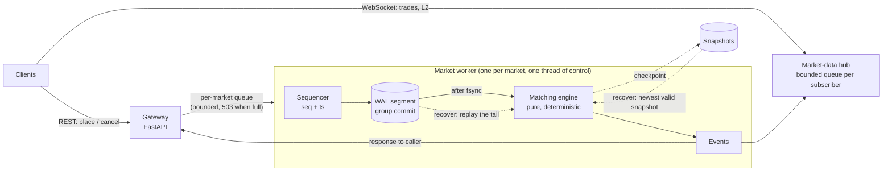
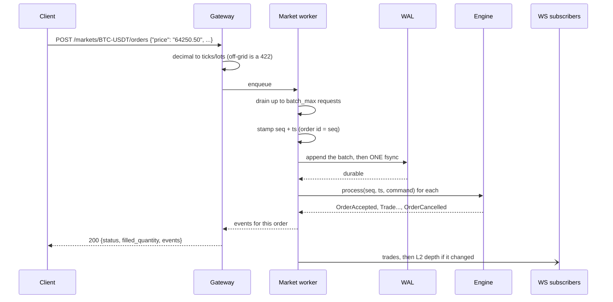

# Matching Engine

[](https://github.com/CtrlAltDevelop/matching-engine/actions/workflows/ci.yml)
[](https://pypi.org/project/matching-engine/)
[](https://github.com/CtrlAltDevelop/matching-engine/releases)
[](pyproject.toml)
[](pyproject.toml)
[](LICENSE)

A price-time priority order book that matches deterministically, survives a
crash with every acknowledged order intact, and publishes measured numbers
rather than claimed ones.

- **Deterministic:** no clock or randomness inside the engine. The same log
  always rebuilds the same book, down to queue position, checked by a state
  hash.
- **Durable:** checksummed, length-framed write-ahead log with group commit;
  torn writes are detected and cut off, corruption is refused, snapshots
  bound replay time.
- **Exact:** integer ticks and lots from the gateway inwards; decimals only
  on the wire, as strings.
- **Tested the way it can fail:** golden files, property-based invariants,
  replay determinism, and a real process killed mid-load.

Pure, typed Python (3.12+, `mypy --strict`), with the engine boundary drawn so
a Rust/PyO3 core can replace it later ([ADR 4](docs/adr/0004-python-first-with-a-rust-path.md)).

## Architecture



Each market has its own worker, sequencer, WAL, snapshots and book; markets
share nothing ([ADR 1](docs/adr/0001-single-threaded-engine-per-market.md)).

### One order, end to end



Nothing is acknowledged before it is on disk. While one fsync runs, the next
batch queues up behind it, so batches grow with load and no timer is needed
([ADR 2](docs/adr/0002-wal-format-and-fsync-policy.md)).

## Order book

Each side is a `SortedList` of price keys plus `dict[key, PriceLevel]`; each
level is an intrusive doubly linked FIFO of orders; the book keeps
`dict[order_id, node]`. Bid keys are negated prices, so on both sides
`keys[0]` is the best level and "crosses the limit" is one comparison.

| Operation | Complexity |
|---|---|
| Add at an existing price level | O(1) |
| Add at a new price level | O(log L) |
| Cancel (level stays non-empty) | O(1) |
| Cancel (last order at its level) | O(log L) |
| Best bid / ask | O(1) |
| Fill against the head of the best level | O(1) per fill |
| L2 depth, top *n* levels | O(n) |
| FOK fillability check | O(levels crossed), no mutation |

*L* is the number of distinct price levels on one side. A `deque` per level
would make cancel O(n) in the queue length; the linked list with an id index
is what makes it O(1).

## Order types and rules

| Feature | Behaviour |
|---|---|
| Limit | Matches at the resting price (price improvement for the taker); the remainder rests if GTC |
| Market | Sweeps the book; must be IOC or FOK, since a market order has no price to rest at |
| GTC / IOC / FOK | Rest / cancel the unfilled part / fill completely or reject with no trades |
| Post-only | Rejected if it would take liquidity; must be GTC |
| Self-trade prevention | `cancel_taker` (default), `cancel_maker`, `cancel_both`, or `none` |
| Cancel | Owner only; cancelling a filled or unknown order is rejected |

Every command produces an ordered list of events — `order_accepted`, `trade`,
`order_cancelled` (reason `user`, `unfilled` or `self_trade`),
`order_rejected` (with a reason) — each carrying the command's `seq` and `ts`.

## Quickstart

```bash
uv sync --all-extras
uv run matching-engine serve            # http://127.0.0.1:8000/docs
```

```bash
# rest a sell, then take part of it with a market buy
curl -s localhost:8000/markets/BTC-USDT/orders -H 'content-type: application/json' \
  -d '{"account": 2, "side": "sell", "price": "64000.50", "quantity": "0.5"}'
curl -s localhost:8000/markets/BTC-USDT/orders -H 'content-type: application/json' \
  -d '{"account": 1, "side": "buy", "type": "market", "quantity": "0.2"}'

curl -s localhost:8000/markets/BTC-USDT/depth        # L2
curl -s localhost:8000/markets/BTC-USDT/book         # L3
curl -s -X DELETE 'localhost:8000/markets/BTC-USDT/orders/1?account=2'
# live feed: ws://localhost:8000/markets/BTC-USDT/ws
```

Or with Docker: `docker compose up --build`. State lives in the
`engine-data` volume.

To inspect a market's files without changing them (after a crash, say):

```bash
uv run matching-engine verify data/BTC-USDT
```

It prints the snapshot used, the records replayed, any torn tail found, and
the state hash.

### Configuration

| Variable | Default | Meaning |
|---|---|---|
| `ME_DATA_DIR` | `data` | One subdirectory per market: `wal/`, `snapshots/` |
| `ME_MARKETS` | `BTC-USDT:0.01:0.00001,ETH-USDT:0.01:0.0001` | `SYMBOL:TICK:LOT`, comma-separated |
| `ME_FSYNC` | `1` | `0` leaves flushing to the OS (ADR 2 says what that risks) |
| `ME_BATCH_MAX` | `512` | Commands per group commit |
| `ME_QUEUE_MAX` | `10000` | Pending commands per market before 503 |
| `ME_SNAPSHOT_EVERY` | `100000` | Commands between checkpoints |
| `ME_DEPTH_LEVELS` | `20` | L2 levels pushed over WebSocket |
| `ME_SUBSCRIBER_QUEUE` | `1000` | Messages buffered per subscriber before it is dropped |

## Tests

```bash
make check     # ruff, ruff format --check, mypy --strict, pytest
```

| Suite | What it proves |
|---|---|
| `test_golden.py` + `tests/golden/*.json` | Exact event streams for partial fills, level sweeps, time priority, market and IOC remainders, FOK reject then fill, cancel after partial, cancel rejections, post-only, all three STP modes, validation |
| `test_properties.py` (Hypothesis) | After any random flow: the book is never crossed, levels and index agree, every accepted lot is filled, cancelled or still resting, no fill is worse than the taker's limit, and export/restore mid-flow changes nothing |
| `test_recovery.py` | The same WAL twice gives the same state hash; a truncated or corrupted last record is dropped and repaired; mid-log corruption and missing segments are refused; snapshot fallback; segment rolling and pruning |
| `test_crash.py` | A real writer process is killed (`TerminateProcess`/`SIGKILL`) mid-load; every acknowledged seq is recovered and the state matches an in-memory replay |
| `test_gateway.py`, `test_marketdata.py` | REST contract, decimal handling, 422s, owner-only cancel, a restart resumes book and sequence, concurrent orders get unique seqs, a full queue gives 503, WebSocket snapshot then trades and depth, a slow subscriber is dropped |

## Benchmarks

Measured, not estimated. Machine: **Windows 11 (build 28000), Intel Core
i7-7700HQ @ 2.80 GHz (4 cores / 8 threads, laptop), 32 GB RAM, SATA SSD,
CPython 3.14.7**. Workload: `matching_engine.workload.order_flow(seed=42)`:
25% cancels, 5% market orders, the rest limit orders within 50 ticks of mid,
about 1 in 10 crossing. This laptop's results vary a lot between runs
(thermal throttling, background load), so two separate sessions are shown
and every figure is the median of several runs with its range.

**Engine, in-process** (`bench/bench_engine.py --orders 1000000`), 1M
commands, 189,443 trades, 411,172 orders resting at the end:

| | Session 1 | Session 2 |
|---|---|---|
| Throughput | 195,906–241,845 cmd/s (3 runs) | median 206,717 cmd/s (185,755–227,466, 5 runs) |
| Latency p50 | 3.1 µs | 4.6 µs |
| Latency p99 | 21.5 µs | 26.6 µs |
| Latency p99.9 | 45.1 µs | 104.4 µs |

**Recovery** (`bench/bench_recovery.py --events 1000000`), 56.0 MB of WAL,
7.1 MB snapshot. Recovery includes reading, checking every CRC and sequence
number, decoding and re-running the engine:

| | Session 1 (1 run) | Session 2 (median of 3, range) |
|---|---|---|
| Full replay, 1M records, no snapshot | 12.27 s | 21.56 s (12.04–22.47) |
| Snapshot at 900k + 100k-record tail | 3.31 s | 4.32 s (3.82–6.02) |

A separate spot check on an idle machine gave 6.9 s and 1.9 s, which shows
how much of the spread is the machine. The snapshot path is consistently
3–5× faster.

**WAL group commit** (append + `fsync` every *n* records):

| fsync every | Session 1 | Session 2 |
|---|---|---|
| 1 record | 906 rec/s | 741 rec/s |
| 64 records | 47,818 rec/s | 5,430 rec/s |
| 512 records | 171,843 rec/s | 80,938 rec/s |

**End to end over HTTP** (`bench/bench_gateway.py`: real uvicorn +
httptools on loopback, 2,000 sequential orders, then 20,000 orders from 64
connections spread over 4 client processes on the same machine):

| | 1 client p50 | p99 | p99.9 | 64 clients |
|---|---|---|---|---|
| fsync on | 3.8 ms | 7.1 ms | 10.0 ms | 894 orders/s |
| fsync off | 1.9 ms | 3.3 ms | 5.3 ms | 1,320 orders/s |

The engine does an order in microseconds; the gateway takes milliseconds. A
bare ASGI "hello" app measured about 1.3 ms per round trip on this machine, so
the HTTP stack (and the load generator sharing the CPU) is the ceiling, not
matching or the WAL. With fsync on, group commit keeps throughput within
about a third of fsync off. The next step is a binary protocol or a
process per market, not a faster book.

### Profiling

```bash
make profile                                    # cProfile -> profile.pstats
uv tool run snakeviz profile.pstats             # browse it
# flamegraph (Linux/macOS, or Windows as admin):
uv tool run py-spy record -o flame.svg -- python bench/bench_engine.py --orders 200000 --runs 1
```

## Roadmap

- **Rust core via PyO3.** Replace `engine.py`/`book.py` behind the same
  boundary (`process`, `export_state`, `restore`, `state_hash`), then publish
  both sets of numbers side by side. The golden, property and replay suites
  become the acceptance tests: same WAL in, same events and hash out.
- **A process per market**, fed over a ring buffer or shared-memory queue, so
  markets stop sharing one GIL (or run on a free-threaded interpreter).
- **Client order ids** for idempotent retries after a timeout.
- **Stop and stop-limit orders**, and amend (price/quantity) with defined
  priority rules.
- **Ledger integration:** place a hold before sequencing and settle on
  `trade` events, so an account cannot trade funds it does not have.
- **Replication:** acknowledge once a follower has the WAL record, to take
  the fsync out of the latency path without losing durability.
- **Incremental L2/L3 feed** with sequence numbers for gap detection, instead
  of full depth snapshots.

## Known limitations

- **No authentication, risk checks or balances**; see [SECURITY.md](SECURITY.md).
  The `account` field is trusted as sent.
- **All markets share one Python process and GIL.** They share no state, so
  this limits aggregate throughput, not correctness.
- **Throughput is bounded by the HTTP stack**, not the engine; see the
  benchmarks.
- **Order ids are only checked for uniqueness among live orders** inside the
  engine; the gateway makes them globally unique by using the sequence number.
- **Tick and lot size are fixed per market**; changing them would
  reinterpret stored orders.
- **Depth over WebSocket is a full top-*n* snapshot per change**: simple and
  impossible to drift, but heavier than deltas.
- **A checkpoint pauses its market while the snapshot is encoded**; only the
  file write runs off-thread.

## Architecture decisions

1. [One single-threaded engine per market](docs/adr/0001-single-threaded-engine-per-market.md)
2. [WAL format, group commit and what a crash can lose](docs/adr/0002-wal-format-and-fsync-policy.md)
3. [Integer ticks and lots instead of floats or Decimal](docs/adr/0003-integer-ticks-and-lots.md)
4. [Python first, with a clean path to a Rust core](docs/adr/0004-python-first-with-a-rust-path.md)

## License

[MIT](LICENSE) © 2026 Mohammad Zarif
